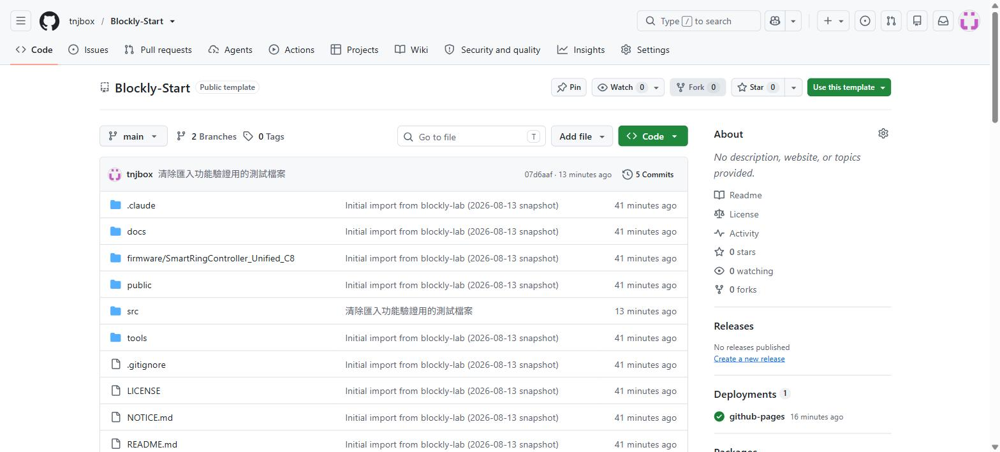
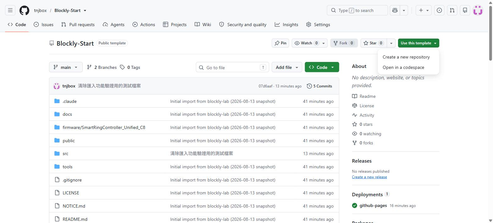
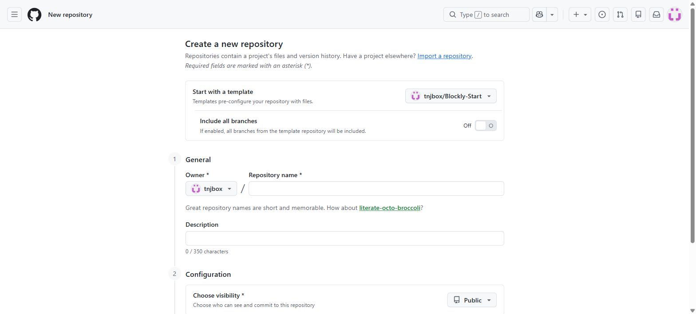
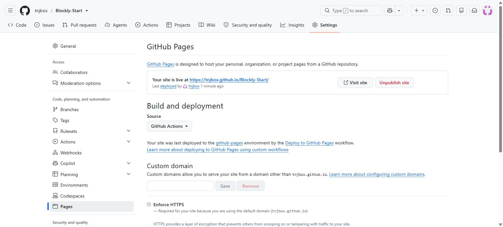
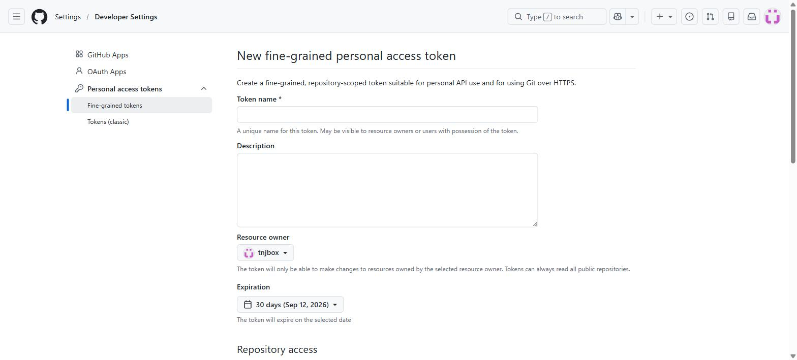
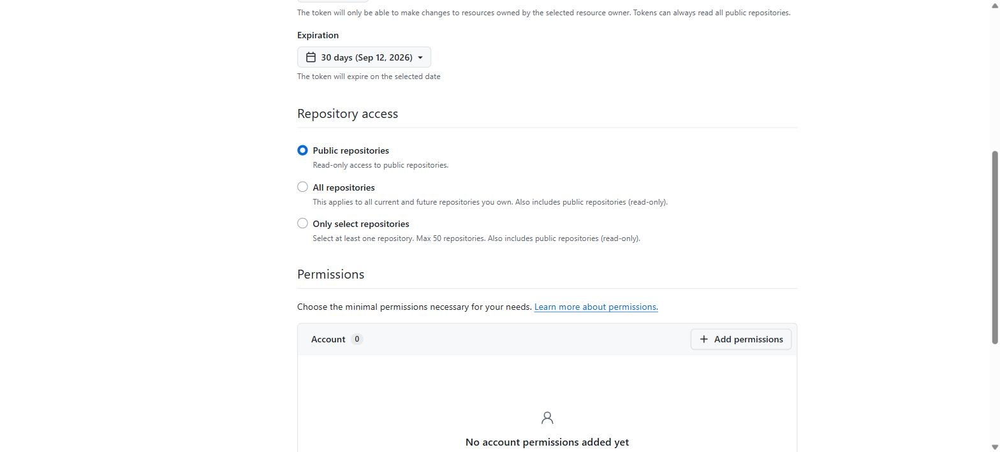
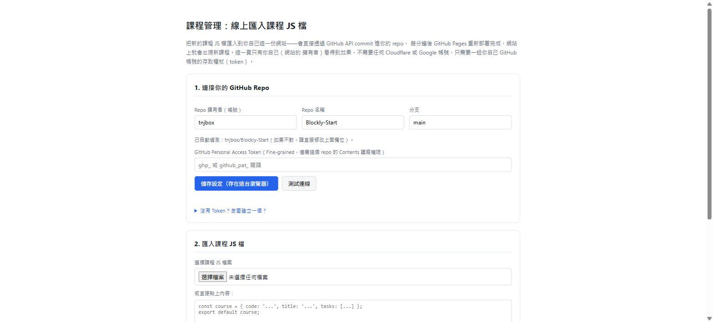

# Blockly Start

**Blockly Start** 是「Younger Dream Workshop」開發的 Blockly 程式解題教學平台**公開範本**——設計給其他縣市、其他學校的老師「複製一份」，架設自己專屬的教學網站。整個網站是純靜態網頁（GitHub Pages），不需要任何付費服務，只需要一組免費的 GitHub 帳號。

原始範本網址：<https://github.com/tnjbox/Blockly-Start>

---

## 這份範本包含什麼

- Blockly 積木程式解題介面（比照競賽平台的積木群組與評分邏輯）
- SmartRingController 硬體互動課程（SRA00 / SRB00 / SRC00 / SRF00）
- 內建基礎練習課程（JSA00 / JSB00）
- **課程管理頁面**：不需要會寫程式、不需要用 git，直接在瀏覽器上傳/貼上課程 JS 檔案，就能把新題目加進你自己的網站
- 系統評分**完全在瀏覽器本機執行**，不需要任何後端伺服器、不需要 Cloudflare、不需要 Google 帳號

> 「上傳成績」按鈕保留在畫面上（維持版面一致），但這份範本沒有串接任何成績上傳後端，按下去不會有任何動作。

---

## 複製這份範本，變成你自己的網站

整個流程大概 10～15 分鐘，只需要重複一次就好，之後想加新題目直接用「課程管理」頁面即可，不用重跑這幾個步驟。

### 步驟 1：用「Use this template」複製一份到你自己的帳號

1. 用你自己的 GitHub 帳號登入 <https://github.com>（沒有帳號的話，免費註冊一個即可）。
2. 到 <https://github.com/tnjbox/Blockly-Start>，按右上角綠色的 **Use this template** 按鈕，選 **Create a new repository**。

   

   

3. 在「Create a new repository」頁面：
   - **Owner** 選你自己的帳號
   - **Repository name** 幫你的網站取個名字（例如 `blockly-start-新竹`），這個名字會出現在你網站的網址裡
   - **Public** 或 **Private** 都可以，但要用 GitHub Pages 免費方案的話建議選 **Public**
   - 按下面的 **Create repository**

   

完成後，你會有一份完整的程式碼副本，在你自己的帳號底下，跟原始範本完全獨立，之後彼此的修改互不影響。

### 步驟 2：開啟 GitHub Pages，讓網站真的上線

這份範本內建 GitHub Actions 自動部署（`.github/workflows/deploy.yml`）：只要 repo 裡有程式碼，
每次 push 到 `main` 分支都會自動重新建置、自動部署，**不需要任何人在自己電腦上跑 `npm install`
或 `npm run build`**。你唯一要做的是切換一次「Source」設定：

1. 到你剛複製出來的 repo，點上方的 **Settings** → 左邊選單的 **Pages**。
2. **Source** 選「**GitHub Actions**」（不是「Deploy from a branch」）。

   

3. 這個設定一存檔，Actions 通常已經在背景自動跑過一次了（複製 repo 那個當下的 commit 就會觸發）。到上方 **Actions** 分頁可以看到「Deploy to GitHub Pages」的執行紀錄，綠色勾勾代表成功；第一次執行大約需要 1～2 分鐘（要安裝套件+建置）。
4. 成功後回到 Settings → Pages，會顯示「Your site is live at ...」，網址格式是 `https://你的帳號.github.io/你的repo名稱/`（例如 `https://tnjbox.github.io/Blockly-Start/`），點進去確認能正常打開。

   > **如果 Actions 分頁顯示執行失敗（紅色 X）**：點進去看錯誤訊息，最常見是 npm 套件安裝逾時，重新整理頁面按右上角 **Re-run all jobs** 通常就會過。如果不確定怎麼排查，可以直接聯絡 Younger Dream Workshop 協助。

### 步驟 3：（選用）建立 GitHub Token，供「課程管理」頁面使用

如果你只是想用內建的 SmartRing／JSA00／JSB00 課程，這一步可以先跳過；等你想加入自己的題目時再回來做。

1. 登入 GitHub，前往 <https://github.com/settings/personal-access-tokens/new>。

   

2. **Token name** 隨便取一個好認的名字（例如「Blockly Start 課程管理」）。
3. **Expiration** 選你覺得合適的期限（例如 90 天，到期後要重新申請一組新的）。
4. **Repository access** 選 **Only select repositories**，選你剛複製出來的那個 repo（**不要選 All repositories**，只給這一個repo 的權限最安全）。
5. 往下捲到 **Permissions** → **Repository permissions**，找到 **Contents**，設成 **Read and write**（其他權限保持預設「No access」即可）。

   

6. 拉到最下面按 **Generate token**，GitHub 會顯示一長串 `github_pat_` 開頭的字串——**這個畫面關掉後就再也看不到了**，先複製起來存好（例如貼到密碼管理工具），不要分享給別人。

### 步驟 4：用「課程管理」頁面設定並匯入課程

1. 打開你網站的 `manage.html`（例如 `https://你的帳號.github.io/你的repo名稱/manage.html`），或直接從首頁下方的「課程管理（匯入JS課程檔）」連結點進去。
2. **Repo 擁有者**、**Repo 名稱** 通常會自動偵測正確（畫面上會顯示「已自動偵測」），如果不對就手動改成你自己的帳號跟 repo 名稱。**分支**通常保持 `main` 就好。
3. 把步驟 3 拿到的 Token 貼進 **GitHub Personal Access Token** 欄位，按 **儲存設定**，再按 **測試連線** 確認顯示「連線成功」。

   

4. 準備好課程 JS 檔案（格式跟 `src/courses/` 資料夾裡既有的檔案一致：`const course = {...}; export default course;`），用「選擇課程 JS 檔案」上傳，或直接貼在下面的文字框裡。
5. 按 **驗證課程內容**，畫面會顯示課程代碼、標題、題目數；如果格式有問題會顯示具體錯誤訊息。
6. 驗證通過後按 **匯入到我的網站**，幾秒內會顯示已經 commit 成功。**通常 1～2 分鐘後**（GitHub Pages 重新部署完成）回到首頁，輸入剛才那個課程代碼就能看到新題目。

### 之後每次要加新題目

只要重複步驟 4（不用重新複製 repo，也不用重新開 Pages），token 有效期內都可以隨時匯入。

---

## 常見問題

**Q：GitHub Pages開了但網站還是打不開？**
通常是還在部署中，等 2～3 分鐘再重整一次（記得強制重新整理／清瀏覽器快取，不然可能還是看到舊版畫面）。如果超過 10 分鐘還是不行，回到 Settings → Pages 確認 Source 是不是選「GitHub Actions」，並到 **Actions** 分頁確認「Deploy to GitHub Pages」有沒有執行失敗。

**Q：manage.html「測試連線」失敗？**
先確認 Token 有沒有過期，再確認建立 Token 時 **Repository access** 有沒有選對這個 repo、**Contents** 權限是不是設成「Read and write」（不是預設的「No access」）。

**Q：匯入後網站沒有出現新題目？**
GitHub Pages 重新部署需要一點時間，先等 2～3 分鐘。如果還是沒有，回到 repo 的 **Actions** 分頁看有沒有部署失敗的紀錄。

**Q：Token 弄丟了 / 想收回權限？**
到 <https://github.com/settings/personal-access-tokens> 找到那組 token，按 **Delete** 就會立刻失效，之後重新建一組新的貼進 manage.html 即可。

**Q：可以把網站標題、顏色改成自己學校的樣子嗎？**
可以，`index.html` 裡的標題文字、`src/style.css` 裡的顏色都可以直接修改，屬於平台程式碼（MIT License），可以自由調整。

---

## 授權與版權

平台程式碼（MIT License）與內建課程內容（CC BY-NC-SA 4.0）的授權條款、引用格式、教師改作標示建議，請見網站內建的 [授權與引用說明頁面](public/license.html)（部署後路徑為 `/license.html`）。

---

## 開發指令（給要修改程式碼的人）

```bash
npm install        # 安裝套件
npm run dev         # 本機開發伺服器
npm run build        # 建置正式版
npx gh-pages -d dist   # 部署到 GitHub Pages
```
